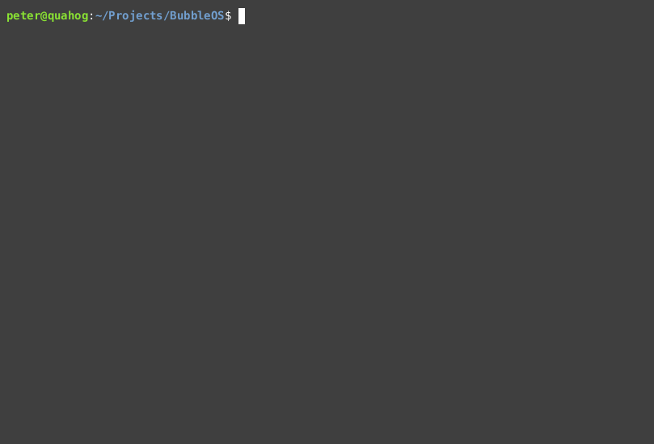
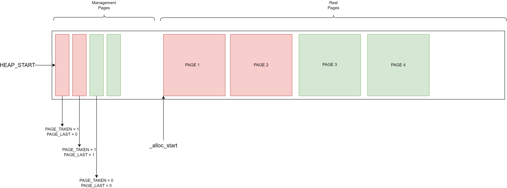
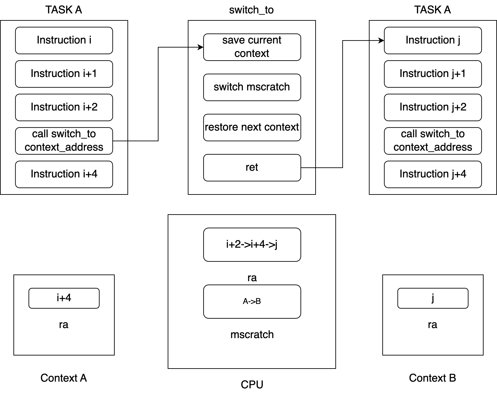

# BubbleOS: A RISC-V Operating System in C

BubbleOS is an operating system for personal educational purposes, aimed at providing insight into the fundamentals of operating system development.

## Overview
This project serves as a practical learning resource for those interested in understanding the essentials of OS development. It offers page memory management, preemptive/cooperative multitasking, trap(interrupts and exception handling), timer, spin lock, and system call.

## Future Development
In the future, BubbleOS will undergo a major overhaul and transition to Rust programming language. This transition will introduce advanced features including Virtual Memory support, File Systems implementation, and Network components integration.
## Boot

## UART

## Memory Management

The length of Memory is 128M = 8 managment pages * 4096 bytes * 4096 page size

BubbleOS utilizes a page-based memory management system. The first 8 pages are dedicated to management, followed by real pages for data storage. Each byte within the management pages stores a flag, where the last two bits represent PAGE_LAST (indicating if the page is the last page of an allocation) and PAGE_TAKEN (indicating if the page is currently in use).

For example, a flag value of 0x0000_0001 signifies that the page is currently in use and is not the last page of an allocation.

## Cooperative Multitasking

In Cooperative Multitasking, before a new task can be executed, the current one must voluntarily give up the CPU.

* `mscratch`: A register in Machine mode to point current context
* `ra(x1)`: General register to save the return address
* `ret`: jump back to `ra`
* `call`: will also store the next address of instruction into `ra`

There are two tasks, A and B. Task A is running on the CPU. When it calls `switch_to` to switch to task B, it stores the address of the next instruction of task A in the `ra` register before entering the `switch_to` function in BubbleOS. Inside `switch_to`, it saves the context of task A into memory, then restores the context of task B from memory on top of that in order to execute the instructions for task B it `ret`(jump to the instruction in B).

## Trap and Exception
Trap is Exceptional Control Flow(ECF) in RISC-V.

Trap initialize -> Top Half(Hardware, cannot be controled) -> Bottom Half(Our logic) -> Return

### Trap init
  * setting BASE address by `mtvec` register
### Top half
* copy MIE in `mstatus` to MPIE and clean MIE to close interrupt
* setting `mepc` and `mtvec`,  `mepc` will be set to the address of next command if trap is caused by interrupt. if trap is caused by Exception, `mepc` will be set to the address of current command.
* setting `mcause` and `mtval`
* save previous priviledge to MPP in `mstatus` and change the current priviledge to Machine
### Trap Bottom
* save context
* call function `trap_handler`
* return
* restore context

### Exit trap
* execute MRET to restore trap status
  * current privilidge of hart = mstatus.MPP
  * mstatus.MPP = U or M
  * mstatus.MIE = mstatus.MPIE
  * mstatus,MPIE = 1
  * pc = mepc

## External Interrupt
* Interrupt
  * Local interrupt
    * software interrupt
    * timer interrupt
  * Global interrupt
    * externrl interrupt

* interrupt steps:
  * Copy MIE from `mstatus` to MPIE and clean MIE to disable interrupt
  * Copy next instruction address to `mepc`
  * Set PC = `mtvec`
  * Set `mcause` and `mtval`
  * Copy previous to MPP in `mstatus` and Set current to M
  
### Platform-Level Interrupt Controller
Because every hart only has one external interrupt pin, we need a hub to control all interruptions -- PLIC

## Time interrupt
It is a local interrupt cause by CLINT(Core Local Interrupt)
1. mtime = 0 and mtiomcmp += INTERVAL
2. wait for timer interrupt
3. excute interrupt steps and set mtimecmp += INTERVAL

## Acknowledge
* https://github.com/plctlab/riscv-operating-system-mooc
* https://osblog.stephenmarz.com/